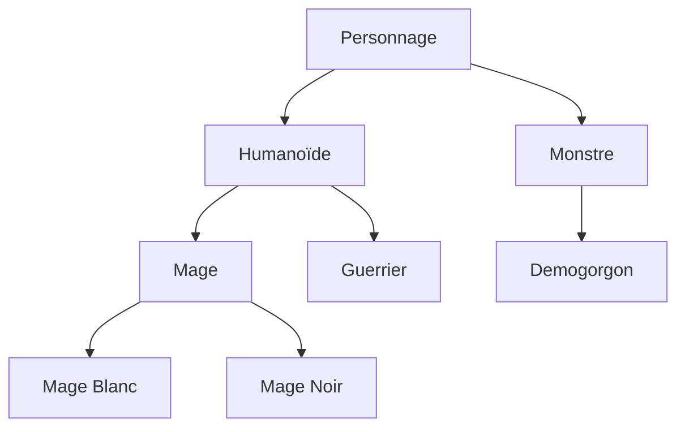
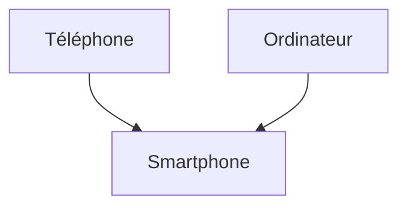

# Python 3 Formation 2


# 1 - Pourquoi l'objet ?

Il est tout à fait possible de réaliser un programme sans l'utilisation des objets, mais c'est se priver d'une des forces du langage et bien souvent on perd plus de temps à programmer un programme sans objets qu'avec.

Depuis le début de la formation, vous avez manipulé pas mal d'objets et ils nous ont facilité la vie.
Par exemple avec `requests` chaque requête nous retourne en résultat un **objet** `Response` qui contient le code HTTP et le contenu s’il existe, ou bien `terminaltables` qui nous a permis d'afficher de jolis tableaux sans nous soucier de la mécanique interne.
Les avantages de l'objet sont :  
- Complexifier les programmes tout en les rendant plus lisibles à l'aide de l'abstraction  
- Un meilleur moyen de travailler en équipe  
- Cloisonner les données à l'aide de l’encapsulation  
- Réutiliser des morceaux entiers de programme en quelques lignes
Un objet est un type de variable 

## Classe

Les classes sont la base de la programmation objet, elles définissent les **attributs** et les **méthodes** que contiendront nos objets.
On peut comparer une classe à un plan de construction d'une voiture, une voiture possède :
- Un numéro de série
- Un poids à vide
- Une accélération
- Etc ... 
Et avec une voiture, il est possible :
- D’accélérer
- Freiner
- Etc

### Création d'une classe

La création d'une classe se fait à l'aide du mot clé `class`
Exemple d'une classe définissant un personnage :

```python
class Personnage:
    """
    Represente un personnage
    """
```

Et voilà nous avons créer notre première classe, elle ne fait rien, mais existe belle est bien
Le code peut aussi être écrit comme ça :

```python
class Personnage(object):
    """
    Represente un personnage
    """
```

Toutes les classes héritent de la classe `object` qui est l'objet de base Python (voir le chapitre sur l'héritage).  
Afin de rendre le code plus lisible, Python nous permet d’omettre `object` lors de la déclaration d'une classe.

## Instance

L'instance est l'objet créer à partir de la classe, et chaque instance est différente des autres
On crée une instance en utilisant le nom de la classe suivi de parenthèses

Exemple : 
```python
class Personnage:
    """
    Represente un personnage
    """
    
>>> dustin = Personnage()
>>> will = Personnage()
>>> print(dustin)
<__main__.Personnage object at 0x031155D0>
>>> print(will)
<__main__.Personnage object at 0x031155F0>
>>>
``` 
On a créé 2 instances de la classe `Personnage`, et chaque objet est différent (adresse mémoire différente)

# 2 - Attributs

Les attributs sont les variables encapsulées dans l'objet, reprenons l'exemple de notre personnage, nous souhaitons que notre personnage possède un nom, des points de vie, etc ... Ce sont les attributs de l'objet personnage

## Déclaration

La définition des attributs est à faire dans la **méthode** (voir chapitre suivant) `__init__(self)` 
Cette méthode un peu particulière est le **constructeur**, elle est appelée lors de l'instanciation de l'objet.

Exemple :
```python
class Personnage:
    """
    Represente un personnage
    """
    
    def __init__(self):
        # La déclaration des variables commence ici
        self.nom = ''
        self.pt_vie = 0
        
>>> dustin = Personnage()
>>> dustin.nom
''
>>> dustin.pt_vie
0
```

En Python la bonne pratique est de définir les attributs d'un objet dans le constructeur de la classe.
Il est aussi possible de définir les attributs à la volée, mais cette pratique est déconseillée, car il devient alors très compliqué pour un autre développeur de comprendre votre code (ou vous même après 6 mois à avoir travailler sur un autre sujet)

Exemple :
```python
class Personnage:
    """
    Represente un personnage
    """
    
>>> p = Personnage()
>>> p.nom
Traceback (most recent call last):
  File "<stdin>", line 1, in <module>
AttributeError: 'Personnage' object has no attribute 'nom'
>>> p.nom = 'Dustin'
>>> p.nom
'Dustin'
```

### Self

Le mot clé `self` présent dans le constructeur représente l'instance de l'objet, dans le constructeur, on peut traduire `self.nom = ''` par "défini mon nom à vide que je suis créé"

## Déclaration avec paramètres

Il est tout à fait possible de spécifier des paramètres lors de la création de notre objet, il suffit de le spécifier dans le **constructeur** qui est au final une fonction de l'objet, on peut donc spécifier des valeurs par défaut
> Le passage de paramètres implique de fournir des données lors de l'instanciation

Exemple:
```python
class Personnage:
    """
    Represente un personnage
    """
    def __init__(self, nom, pt_vie=100):
        self.nom = nom
        self.pt_vie = pt_vie
>>> perso1 = Personnage('Dustin', 150)
>>> perso2 = Personnage('Will', 100)
>>> perso3 = Personnage('Lucas')
>>> perso1.pt_vie
150
>>> perso3.pt_vie
100
>>> perso2.nom
'Will'
>>>
```

## Objets composés 

Un objet peut être composé d'objets eux-mêmes composés d'objets si nous le souhaitons

Exemple:
```python
class Piston:
    """
    Represente un piston
    """
    def __init__(self, diameter=100):
        self.diameter = diameter

class Moteur:
    """
    Represente un moteur
    """
    def __init__(self, nb_piston=4):
        self.pistons = [Piston() for i in range(0, nb_piston)]
        
class Vehicule:
    """
    Represente un vehicule
    """
    def __init__(self):
        self.moteur = Moteur()
        
>>> v = Vehicule()
>>> v.moteur
<__main__.Moteur object at 0x039857F0>
>>> v.moteur.pistons
[<__main__.Piston object at 0x03985830>, <__main__.Piston object at 0x039858B0>, <__main__.Piston object at 0x039858D0>, <__main__.Piston object at 0x039858F0>]
>>> v.moteur.pistons[0]
<__main__.Piston object at 0x03985830>
```

## Attributs statiques

Comme nous l'avons vu précédemment, les attributs sont propres à chaque instance, modifier un attribut d'une instance ne modifie pas les autres instances.

Il arrive qu'on souhaite définir un attribut commun à l'ensemble des instances, c'est un attribut statique.  
On peut accéder à un attribut statique en faisant `<ma_classe>.<mon_attribut>` ou `<mon_instance>.<mon_attribut>`

Exemple:
```python
class Personnage:
    """
    Represente un personnage
    """
    
    max_pt_vie = 200  # Pour l'ensemble des instances, maxPtVie vaudra 200
    
    def __int__(self, pt_vie=100):
        self.pt_vie = pt_vie
        
>>> Personnage.max_pt_vie       # Accès à l'attribut statique via la classe
200
>>> dustin = Personnage()
>>> will = Personnage()
>>> dustin.max_pt_vie           # Accès à l'attribut statique via l'instance
200
>>> will.max_pt_vie
200
>>> Personnage.max_pt_vie = 150  # Modification de l'attribut statique
>>> dustin.max_pt_vie            # Mise à jour effectuée dans l'ensemble des instances
150
>>> will.max_pt_vie
150
>>>
```

## Attributs privés

Les attributs privés sont des attributs uniquement accessibles dans le code de notre classe. 

Pour des questions de bonnes pratiques, on essaie de mettre le maximum d'attributs en privé.

Dans l'exemple d'un Personnage, on ne souhaite pas que le développeur qui utilise notre classe puisse modifier les points de vie du personnage sans contrôle de notre part.

### Déclaration

Pour déclarer un attribut privé, on précède le nom de `__`.

Exemple :
```python
# Classe avec attribut public
class PersonnageA:
    def __init__(self, pt_vie):
        self.pt_vie = pt_vie
        
# Classe avec attribut privé
class PersonnageB:
    def __init__(self, pt_vie):
        self.__pt_vie = pt_vie
        
    def afficherVie(self):
        print(self.__pt_vie)
>>> dustin = PersonnageA(100)
>>> dustin.pt_vie
100
>>> dustin.pt_vie = 50
>>> dustin.pt_vie
50
>>> will = PersonnageB(100)
>>> will.__pt_vie
Traceback (most recent call last):
  File "<stdin>", line 1, in <module>
AttributeError: 'PersonnageB' object has no attribute '__pt_vie'
>>> will = PersonnageB(100)
>>> will.afficherVie()
100
```

On peut voir que Python nous empêche d'accéder à notre attribut depuis l'extérieur de l'objet, mais qu'il est bien accessible depuis notre instance via `self`.

### Pas si privé que ça

En fait, Python ne nous empêche pas vraiment d'accéder à l'attribut, il le cache sous un autre nom.
On peut s'en apercevoir en utilisant `__dict__` qui nous retourne l'objet sous forme de dictionnaire
> `__dict__` fait partie des nombreuses choses que Python ajoute à nos objets.

Exemple :
```python
# Classe avec attribut privé  
class PersonnageB:  
    def __init__(self, pt_vie):  
        self.__pt_vie = pt_vie  
  
    def afficherVie(self):  
        print(self.__pt_vie)
        
>>> will = PersonnageB(100)
>>> will.afficherVie()
100
>>> will.__dict__
{'_PersonnageB__pt_vie': 100}
>>> will._PersonnageB__pt_vie
100
>>> will._PersonnageB__pt_vie = 50
>>> will.afficherVie()
50
```

# 3 - Méthodes

Les méthodes sont les interactions disponibles pour manipuler notre objet, Python nous en offre déjà plusieurs, nous en avons déjà vu une, le **constructeur**, nous en verrons d'autres un peu plus loin,
prenons le cas d'un téléphone portable, nous pouvons l’allumer, l’éteindre, appeler, raccrocher, etc ... Ce sont les méthodes de notre objet téléphone.

## Constructeur

Le constructeur est appelé lors de la création d'un objet, il existe par défaut dans tout les objets.
Il est possible de définir notre propre constructeur, il faut pour cela redéfinir la méthode `__init__(self, <param>, ...)`
Contrairement à d'autres langages, il n'est pas possible d'avoir plusieurs constructeurs.

### Exemple :

```python
class Demogorgon:
    """
    Represente un Demogorgon
    """
    
    def __init__(self, adulte=True):
        """
        Constructeur de la classe
        
        :param adulte: True pour adulte, False pour enfant
        :type adulte: bool
        """
        self.is_adulte = adulte
 
>>> demogorgon = Demogorgon()
>>> demogorgon.is_adulte
True
>>> demodog = Demogorgon(False)
>>> demodog.is_adulte
False
>>>
```

## Méthodes d'instance
Il existe plusieurs types de méthode qui ont chacune leurs utilités, les méthodes d'instance sont les plus courantes.

Une méthode d'instance est une méthode qui existe uniquement si un objet est instancié, dans l'exemple du téléphone portable, il est impossible d'appeler avec un plan de téléphone portable, il faut nécessairement que celui-ci existe pour pouvoir effectuer une action.

Elles sont reconnaissables, car le premier argument de la méthode est `self`, une référence de l'instance de la classe  
Il suffit ensuite de faire `<mon_instance>.<ma_methode>()`

### Exemple :
```python
class Personnage:
    """
    Represente un personnage
    """
    def __init__(self, nom, pt_vie=100):
        self.nom = nom
        self.pt_vie = pt_vie
    def direBonjour(self):
        """
        Le personnage dit bonjour dans la console
        """
        print('Bonjour mon nom est ' + self.nom)
>>> perso1 = Personnage('Dustin', 150)
>>> perso2 = Personnage('Will', 50)
>>> perso1.direBonjour()
Bonjour mon nom est Dustin
>>> perso2.direBonjour()
Bonjour mon nom est Will
```

### Méthodes privées

De la même manière que les attributs privés, il est possible de définir des méthodes privées.  
C'est-à-dire que les méthodes seront uniquement accessibles à l'intérieur de la classe.
Pour définir une méthode comme privée, il faut précéder le nom de `__`

```python
class Personnage:  
  
    def __dire_bonjour_prive(self):  
        print('Bonjour !')  
  
    def dire_bonjour_public(self):  
        self.__dire_bonjour_prive()
>>> perso = Personnage()
>>> perso.__dire_bonjour_prive()
Traceback (most recent call last):
  File "<stdin>", line 1, in <module>
AttributeError: 'Personnage' object has no attribute '__dire_bonjour_prive'
>>> perso.dire_bonjour_public()
Bonjour !
>>>
```

## Méthodes statiques

Une méthode statique est une méthode qui existe en dehors de toute instance.  
C'est-à-dire qu'il n'y a pas besoin de créer un objet pour pouvoir utiliser la méthode.  

Ça implique que les attributs d'instance ne sont pas accessibles.
Pour déclarer une méthode statique, on utilise le décorateur `@staticmethod`
> Les décorateurs sont une notion de programmation avancée.
> En substance, un décorateur modifie le comportement de fonctions ou de classes.
> Ici il transforme une fonction en méthode statique
Il suffit ensuite de faire `<mon_classe>.<ma_methode_statique>()`

### Exemple :

Créons un fichier `models.py`contenant le code suivant

```python
class Personnage:
    """Represente un personnage"""
    def __init__(self, nom, vie, mana, attaque, defense, vitesse):
        self.nom = nom
        self.vie = vie
        self.mana = mana
        self.attaque = attaque
        self.defense = defense
        self.vitesse = vitesse
    @staticmethod
    def from_json(data):
        p = Personnage(
            data['nom'],
            data['vie'],
            data['mana'],
            data['attaque'],
            data['defense'],
            data['vitesse']
        )
        return p
```

Il y a ici le constructeur par défaut qui demande l'ensemble des paramètres au développeur, et une méthode statique permettant de créer un personnage via un dictionnaire.

#### Usage : 

Dans le dossier contenant le fichier `models.py` ouvrir un interpréteur.
```python
Python 3.5.2 (default, Nov 23 2017, 16:37:01)
[GCC 5.4.0 20160609] on linux
Type "help", "copyright", "credits" or "license" for more information.
>>> from models import Personnage
>>> perso1 = Personnage('Dustin', 100, 100, 40, 35, 22)
>>> perso1.nom
'Dustin'
>>> perso1.vie
100
>>>
>>> payload = {'nom': 'Will', 'vie': 100, 'mana': 100, 'attaque': 20, 'defense': 20, 'vitesse': 20}
>>> perso2 = Personnage.from_json(payload)
>>> perso2.nom
'Will'
>>> perso2.vie
100
```

## Méthodes de classe

Les méthodes des classes ressemblent énormément aux méthodes statiques.
Pour déclarer une méthode de classe, on utilise le décorateur `@classmethod`.

La méthode doit prendre en paramètre une classe `cls`, de la même manière qu'une méthode d'instance prend `self` en premier paramètre.

### Exemple :

```python
class Personnage:
    """
    Represente un personnage
    """
    
    def __init__(self, nom):
        self.nom = nom
    @staticmethod
    def direBonjourStatic():
        print('Bonjour')
        
    @classmethod
    def direBonjourClass(cls):
        print('{0} : Bonjour'.format(cls))
        
    def direBonjourInstance(self):
        print('{0} : Bonjour je suis {1}'.format(self, self.nom))

>>> Personnage.direBonjourStatic()
Bonjour
>>> Personnage.direBonjourClass()
<class '__main__.Personnage'> : Bonjour
>>> p = Personnage('Dustin')
>>> p.direBonjourInstance()
<__main__.Personnage object at 0x7f46d2f993c8> : Bonjour, je suis Dustin
>>>
```

### Utilité

Les méthodes de classes sont généralement utiles dans le cas de l'héritage (chapitre suivant), reprenons notre fichier `models.py` et ajoutons un héritage.

```python
class Personnage:  
    """Represente un personnage"""  
  
  def __init__(self, nom, vie, mana, attaque, defense, vitesse):  
        self.nom = nom  
        self.vie = vie  
        self.mana = mana  
        self.attaque = attaque  
        self.defense = defense  
        self.vitesse = vitesse  
  
    @staticmethod
    def from_json(data):  
        p = Personnage(  
            data['nom'],
            data['vie'],
            data['mana'],
            data['attaque'],
            data['defense'],
            data['vitesse']  
        )  
  
        return p  
  
# Héritage, le Demogorgon est un Personnage
class Demogorgon(Personnage):  
    """Represente un demogorgon"""
```
Essayons maintenant de créer un personnage et un demogorgon.
```python
>>> from models import Personnage, Demogorgon
>>> will_data = {'nom': 'Will', 'vie': 100, 'mana': 100, 'attaque': 20, 'defense': 20, 'vitesse': 20}
>>> demogorgon_data = {'nom': 'Demogorgon', 'vie': 200, 'mana': 0, 'attaque': 100, 'defense': 100, 'vitesse': 100}
>>>
>>> will = Personnage.from_json(will_data)
>>> will
<model.Personnage object at 0x7f6740cc29e8>
>>> demogorgon = Demogorgon.from_json(demogorgon_data)
>>> demogorgon
<model.Personnage object at 0x7f6740cd8dd8>   # Probleme ici
>>>
```

`demogorgon` est une instance de la classe `Personnage`, hors c'est une instance de la classe `Demogorgon` qu'on souhaitait créer.

Pour remédier au problème, on utilise une @classmethod.
Modifions de nouveau notre fichier `models.py`

```python
class Personnage:  
    """Represente un personnage"""  
  
  def __init__(self, nom, vie, mana, attaque, defense, vitesse):  
        self.nom = nom  
        self.vie = vie  
        self.mana = mana  
        self.attaque = attaque  
        self.defense = defense  
        self.vitesse = vitesse  
  
    @classmethod                # Changement ici
    def from_json(cls, data):  
        c = cls(                # Changement ici
            data['nom'],
            data['vie'],
            data['mana'], 
            data['attaque'],
            data['defense'],
            data['vitesse']  
        )  
  
        return c
```
Essayons de nouveau de créer un personnage et un demogorgon.
```python
>>> from models import Personnage, Demogorgon
>>> will_data = {'nom': 'Will', 'vie': 100, 'mana': 100, 'attaque': 20, 'defense': 20, 'vitesse': 20}
>>> demogorgon_data = {'nom': 'Demogorgon', 'vie': 200, 'mana': 0, 'attaque': 100, 'defense': 100, 'vitesse': 100}
>>> will = Personnage.from_json(will_data)
>>> demogorgon = Demogorgon.from_json(demogorgon_data)
>>> will
<model.Personnage object at 0x7f94c8bc8d30>
>>> demogorgon
<model.Demogorgon object at 0x7f94c8bc8ef0>
>>>
```

Cette fois-ci nous avons bien instancié un Demogorgon.
> L'héritage sera vu au chapitre suivant

## Property (Getter)

Les property sont des méthodes nous permettant d'accéder à des informations en lecture seule.

C'est très pratique quand on veut exposer un attribut privé.
Étant des méthodes nous pouvons aussi faire des opérations avant de retourner l'information.

Pour déclarer une propriété, on utilise le décorateur `@property` et on nomme la méthode en fonction du nom de la propriété souhaité.
La méthode contient uniquement le paramètre `self`
On peut ensuite accéder à l'information via `<mon_instance>.<ma_propriété>`.

### Exemple :

```python
class User:
    
    def __init__(self, last_name, first_bame):
        self.__last_name = last_name
        self.__first_bame = first_bame
        
    @property
    def last_name(self):
        return self.__last_name
    
    @property
    def first_name(self):
        return self.__first_name
    
    @property
    def full_name(self):
        return self.last_name + ' ' + self.first_name

>>> u = User('Robinson', 'Will')
>>> u.first_name
'Will'
>>> u.last_name
'Robinson'
>>> u.full_name
'Robinson Will'
>>> u.first_name = 'Dustin'
Traceback (most recent call last):
  File "<stdin>", line 1, in <module>
AttributeError: can't set attribute
>>>
```

## Setter

Les setters nous permettent de modifier la valeur des **property**, c'est très pratique, car cela nous permet d'avoir un contrôle sur les données fournies par le développeur qui utilise notre classe.

Reprenons l'exemple du personnage, si nous fixons la quantité de vie maximale à 200, nous ne souhaitons pas que le développeur puisse fixer la vie d'un personnage à 300, de même nous ne souhaitons pas que la vie puisse être inférieure à 0.

Les setters nous permettent de faire cela, pour utiliser un setter, il faut avoir déclaré une property.

Pour déclarer un setter, on utilise le décorateur `@<ma_propriété>.setter` et on nomme la méthode en fonction du nom de la propriété souhaité.
La méthode contient le paramètre `self` ainsi que la valeur fournie par le développeur

### Exemple :

```python
class Personnage:
    max_pt_bie = 200
    def __init__(self, pt_vie):
        self.__pt_vie = 0    # On fixe une valeur par défaut  
        self.pt_vie = pt_vie  # On utilise le setter pour contrôler pt_vie  
        
    @property
    def pt_vie(self):
        return self.__pt_vie
    
    @pt_vie.setter
    def pt_vie(self, value):
        if value < 0:
            self.__pt_vie = 0
        elif value < self.max_pt_vie:
            self.__pt_vie = value
        else:
            self.__pt_vie = self.max_pt_vie
            
>>> dustin = Personnage(100)
>>> dustin.pt_vie
100
>>> dustin.pt_vie = 199
>>> dustin.pt_vie
199
>>> dustin.pt_vie = 300
>>> dustin.pt_vie
200
>>> dustin.pt_vie = -1
>>> dustin.pt_vie
0
>>> will = Personnage(-1)
>>> will.pt_vie
0
```

# 4 - Héritage

L'un des avantages de la programmation objet est que l'on peut créer des classes à partir d'autres classes existantes.

On parle alors d'héritage, un classe enfant hérite des attributs et des méthodes d'une classe parent.
Un concept simple, mais extrêmement puissant.

On peut imaginer l'héritage comme un arbre de spécialisations



## Déclaration

Pour déclarer un héritage, il suffit d'ajouter `(<class_parent>)` à suite du nom d'une classe.
On dira que notre classe hérite (ou dérive) la classe parent

### Exemple

```python
class Personnage:
    """
    Generalisation d'un personnage
    """
    def __init__(self, nom, pt_vie=100, level=1):
        self.nom = nom
        self.pt_vie = pt_vie
        self.level = level
    def level_up(self):
        self.pt_vie += 50
        self.level += 1

class Mage(Personnage):
    """
    Represente un Mage
    """

class Guerrier(Personnage):
    """
    Represente un guerrier
    """
    
>>> perso1 = Mage('Will')
>>> perso1.level
1
>>> perso1.level_up()
>>> perso1.level
2
>>> type(perso1)
<class '__main__.Mage'>
>>> perso2 = Guerrier('Hopper')
>>> perso2.level
1
>>> perso2.level_up()
>>> perso2.level
2
>>> type(perso2)
<class '__main__.Guerrier'>
```

> L'exemple est trivial, il n'y a pas de différence entre les classes.
Ici on a généralisé la notion de personnage, et on a créé des classes pour des types de personnages particuliers.  

Les classes `Mage` et `Guerrier` héritent (dérive, est une spécialisation) de la classe `Personnage`, elles possèdent les attributs et la méthode de la classe `Personnage`

## Constructeur

Quand on souhaite ajouter des attributs à une classe enfant, il faut redéfinir le constructeur de la classe ou ajouter des attributs statiques.

Exemple nous souhaitons ajouter des points de mana à notre classe `Mage`

```python
class Mage(Personnage):
    """
    Represente un Mage
    """
    def __init__(self, pt_mana):
        self.pt_mana = pt_mana
>>> perso1 = Mage('Will')
>>> perso1.level
Traceback (most recent call last):
  File "<stdin>", line 1, in <module>
AttributeError: 'Mage' object has no attribute 'level'
```

Et la, problème l'héritage n'a pas fonctionné, notre mage ne possède pas d'attribut `level`.

Le problème vient du fait que nous avons redéfini le constructeur de la classe enfant, et le constructeur de la classe parent n'est plus appelé.

Illustration:
```python
class A:
    def __init__(self):
        print('Constructeur de A')
        
        
class B(A):
    def __init__(self):
        print('Constructeur de B')
        
class C(A):
    def __init__(self):
        super().__init__()
        print('Constructeur de C')
>>> va = A()
Constructeur de A
>>> vb = B()
Constructeur de B
>>> vc = C()
Constructeur de A
Constructeur de C
>>>
```

`super()` nous donne accès à la classe parent.  
Quand on redéfinit un constructeur, il est important d'appeler le constructeur de la classe parent.  
Cela implique qu'il faut fournir tous les arguments obligatoires.

### Exemple

Reprenons nos classes `Mage` et `Guerrier` et appelons le constructeur de la classe `Personnage`

```python
class Personnage:
    """
    Generalisation d'un personnage
    """
    def __init__(self, nom, pt_vie=100, level=1):
        self.nom = nom
        self.pt_vie = pt_vie
        self.level = level
    def level_up(self):
        self.pt_vie += 50
        self.level += 1

class Mage(Personnage):
    """
    Represente un Mage
    """
    def __init__(self, nom, pt_vie=100, level=1, pt_mana=100):
        super().__init__(nom, pt_vie, level)
        self.pt_mana = pt_mana

class Guerrier(Personnage):
    """
    Represente un guerrier
    """
    def __init__(self, nom, pt_vie=150, level=1, force=100):
        super().__init__(nom, pt_vie, level)
        self.force = force
>>> perso1 = Mage('Will')
>>> perso1.level
1
>>> perso2 = Guerrier('Hopper')
>>> perso2.level
1
>>> perso1.ptMana
100
>>> perso2.ptVie
150
``` 

## Héritage multiple

Il est possible d'hériter de plusieurs classes.
Prenons l'exemple d'un smartphone, c'est à la fois un téléphone est un ordinateur.



### Exemple

```python
class Telephone:
    def __init__(self, numero):
        self.numero = numero
    def appeler(self, numero):
        print('Appel vers {0} en cours ...'.format(numero))

class Ordinateur:
    def __init__(self, ip):
        self.ip = ip
    def get_page_web(self, url):
        print('<html><body>{0}</body></html>'.format(url))

class Smartphone(Telephone, Ordinateur):
    def __init__(self, numero, ip):
        Telephone.__init__(self, numero)
        Ordinateur.__init__(self, ip)
>>> s8 = Smartphone('0000000000', 'localhost')
>>> s8.appeler('000000001')
Appel vers 000000001 en cours ...
>>> s8.get_page_web('http://localhost/')
<html><body>http://localhost/</body></html>
>>>
```

Quand on utilise l'héritage multiple, l'utilisation de `super()` est compliqué, car Python ne sait pas qu'elle classe choisir, on le remplace par `<nom_classe_parent>.__init(self, <params>)`.

Lors d'héritage multiple, il faut faire attention aux noms des attributs et des variables, il y a des risques de collisions.  
L'héritage multiple est une notion assez peu utilisée.

## Vérifier le type d'un objet

Bien souvent quand on utilise des méthodes et l'héritage, on souhaite connaitre le type d'un objet.
Pour cela il faut utiliser les fonctions `type` et `isinstance`

### Exemple

`type` nous retourne la classe de l'objet alors que `isinstance` va parcourir l'arbre d'héritage pour nous répondre

```python
class A:  
    """"""  
  
  
class B(A):  
    """"""  
  
  
class C:  
    """"""  
  
  
class D(B, C):  
    """"""
>>> var = D()
>>> type(var)
<class 'sandbox.D'>
>>> isinstance(var, D)
True
>>> isinstance(var, C)
True
>>> isinstance(var, A)
True
```

En général on utilise `isinstance` car on souhaite vérifier un comportement plutôt qu'un type.

# 5 - Polymorphisme

Le polymorphisme, c'est modifier le comportement d'un objet via l'héritage.  
Pour cela on modifie les méthodes de la classe.

## Exemple

Reprenons nos classes, quand un personnage monte de niveau seuls `pt_vie` et `level` sont incrémentés, dans le cas du guerrier et du mage, nous souhaitons incrémenter `pt_mana` et `force` à chaque montée de niveau.

Pour cela on va modifier le comportement de l'objet et redéfinir la méthode `level_up`

```python
class Personnage:
    """
    Generalisation d'un personnage
    """
    def __init__(self, nom, pt_vie=100, level=1):
        self.nom = nom
        self.pt_vie = pt_vie
        self.level = level
    def level_up(self):
        self.pt_vie += 50
        self.level += 1

class Mage(Personnage):
    """
    Represente un Mage
    """
    def __init__(self, nom, pt_vie=100, level=1, pt_mana=100):
        super().__init__(nom, pt_vie, level)
        self.pt_mana = pt_mana
    def level_up(self):      # Redéfinition
        super().level_up()   # Appel de la méthode parent
        self.pt_mana += 25

class Guerrier(Personnage):
    """
    Represente un guerrier
    """
    def __init__(self, nom, pt_vie=150, level=1, force=100):
        super().__init__(nom, pt_vie, level)
        self.force = force
        
    def level_up(self):      # Redéfinition
        super().level_up()   # Appel de méthode parent
        self.force += 25
>>> perso1 = Mage('Will')
>>> perso1.pt_mana
100
>>> perso1.level
1
>>> perso1.level_up()
>>> perso1.pt_mana
125
>>> perso1.level
2
>>>
```

Ici le changement de comportement est très faible, on incrémente juste les propriétés propres à chaque classe enfant.

Mais il y a bien eu changement de comportement.

## Exemple avancé

L'exemple précédent est un exemple simple de polymorphisme, c'est aussi le cas pratique le plus courant.

Mais il est possible d'aller plus loin dans modification de comportement d'un objet.

Prenons l'exemple d'une classe `Couleur` qui représente une couleur au format RGB

```python
class Couleur:
    """
    Represente une couleur
    """
    def __init__(self, r=0, g=0, b=0):
        self.__red = 0
        self.__green = 0
        self.__blue = 0
        self.red = r
        self.green = g
        self.blue = b
    @property
    def red(self):
        return self.__red
    @red.setter
    def red(self, value):
        if value < 0:
            self.__red = 0
        elif value < 255:
            self.__red = value
        else:
            self.__red = 255
    @property
    def green(self):
        return self.__green
    @green.setter
    def green(self, value):
        if value < 0:
            self.__green = 0
        elif value < 255:
            self.__green = value
        else:
            self.__green = 255
    @property
    def blue(self):
        return self.__blue
    @blue.setter
    def blue(self, value):
        if value < 0:
            self.__blue = 0
        elif value < 255:
            self.__blue = value
        else:
            self.__blue = 255
``` 

On aimerait bien pouvoir faire des opérations mathématiques avec nos couleurs, par exemple pouvoir faire une addition ou une soustraction.

### Sans polymorphisme

Une des manières d'y arriver et de créer une méthode `add` et une méthode`sub` à notre classe.

```python
class Couleur:
    ...
    
    def add(self, couleur):
        return Couleur(
            self.red + couleur.red,
            self.green + couleur.green,
            self.blue + couleur.blue
        )
    def sub(self, couleur):
        return Couleur(
            self.red - couleur.red,
            self.green - couleur.green,
            self.blue - couleur.blue
        )
```

Nous pouvons ensuite faire 

```python
>>> c1 = Couleur(1, 1, 1)
>>> c2 = Couleur(2, 2, 2)
>>> c3 = c1.add(c2)
>>> print('{0} {1} {2}'.format(c3.red, c3.green, c3.blue))
3 3 3
>>> c4 = c1.sub(c3)
>>> print('{0} {1} {2}'.format(c4.red, c4.green, c4.blue))
0 0 0
>>>
```

Ça fonctionne, mais ce n'est pas du polymorphisme, nous n'avons pas redéfini le comportement de l'objet, nous avons juste créé 2 nouveaux comportements.

### Avec polymorphisme

Pour faire du polymorphisme, nous allons redéfinir le comportement de l'objet face aux opérateurs `+` et `-`.
Actuellement si nous essayons, l'interpréteur Python n'est pas content :

```python
>>> c1 = Couleur(1, 1, 1)
>>> c2 = Couleur(2, 2, 2)
>>> c3 = c1 + c2
Traceback (most recent call last):
  File "<stdin>", line 1, in <module>
TypeError: unsupported operand type(s) for +: 'Couleur' and 'Couleur'
```

Vous vous souvenez que tous les objets héritent de la classe `object` ?  
Et bien il est possible de redéfinir le comportement de l'objet face à opérateur `+` ou `-` (et bien plus).

Pour cela il suffit de redéfinir les méthodes `__add__` et `__sub__`

```python
class Couleur:
 ...
 
    def __add__(self, couleur):
        return Couleur(
            self.red + couleur.red,
            self.green + couleur.green,
            self.blue + couleur.blue
        )
    def __sub__(self, couleur):
        return Couleur(
            self.red - couleur.red,
            self.green - couleur.green,
            self.blue - couleur.blue
        )
```
> Il faudra penser à vérifier que `couleur` est bien une instance de `Couleur`

Nous pouvons ensuite faire :
```python
>>> c1 = Couleur(1, 1, 1)
>>> c2 = Couleur(2, 2, 2)
>>> c3 = c1 + c2
>>> print('{0} {1} {2}'.format(c3.red, c3.green, c3.blue))
3 3 3
>>> c4 = c1 - c3
>>> print('{0} {1} {2}'.format(c4.red, c4.green, c4.blue))
0 0 0
>>>
```

C'est la toute la force du polymorphisme, notre objet peut se comporter comme un objet mathématique si on lui indique le comportement à avoir.

## Surcharges utiles

L'objet de base Python contient beaucoup de méthodes que nous pouvons redéfinir, nous avons vu `__add__` et `__sub__`, voyons quelques méthodes intéressantes.

### `__str__`

`__str__` est appelé quand Python doit faire des opérations avec des string, comme un `print` ou un `cast`.
La méthode doit retourner un `string`.

Exemple :
```python
class Personnage:  
    def __init__(self, nom):  
        self.nom = nom  
          
    def __str__(self):  
        print('__str__ called')  
        return super().__str__()
>>> perso = Personnage('Will')
>>> perso
<__main__.Personnage object at 0x02DA5690>
>>> print(perso)
__str__ called
<__main__.Personnage object at 0x02DA5690>
>>> 'test' + str(perso)
__str__ called
'test<__main__.Personnage object at 0x02DA5690>'
>>>
```

Ce qui nous permet de faire :

```python
class Personnage:  
    def __init__(self, nom):  
        self.nom = nom  
  
    def __str__(self):  
        return 'Personnage[{0}]'.format(self.nom)
>>> perso = Personnage('Will')
>>> print(perso)
Personnage[Will]
>>> 'test {0}'.format(perso)
'test Personnage[Will]'
>>> 'test ' + str(perso)
'test Personnage[Will]'
>>>
```

### `__repr__`

`__repr__` est appelé quand Python doit retourner une représentation de l'objet

```python
class Personnage:  
    def __init__(self, nom):  
        self.nom = nom  
  
    def __str__(self):  
        print('__str__ called')  
        return super().__str__()  
  
    def __repr__(self):  
        print('__repr__ called')  
        return super().__repr__()
>>> perso = Personnage('Will')
>>> perso
__repr__ called
<sandbox.Personnage object at 0x014C6F30>
>>> str(perso)
__str__ called
__repr__ called
'<sandbox.Personnage object at 0x014C6F30>'
>>> str([perso])
__repr__ called
'[<sandbox.Personnage object at 0x014C6F30>]'
>>>
```

`__str__` est utilisé quand il s'agit de convertir l'objet en`string` quand `__repr__` est utilisé pour retourner une représentation de l'objet.

Exemple plus parlant :
```python
class Personnage:
    def __init__(self, nom, ptVie=100):
        self.nom = nom
        self.ptVie = ptVie
    def __str__(self):
        return '{0}\n  - Points de vie : {1}'.format(
            self.nom,
            self.ptVie
        )
    def __repr__(self):
        return '[{0}] {1}'.format(
            self.__class__.__name__,
            {
                'nom': self.nom,
                'ptVie': self.ptVie
            }
        )
>>> perso = Personnage('Will')
>>> perso
[Personnage] {'nom': 'Will', 'ptVie': 100}
>>> print(perso)
Will
  - Points de vie : 100
>>>
```

### `__eq__`

`__eq__` est appelé quand on veut vérifier l'égalité entre 2 objets à l'aide de l'opérateur `==`, ou bien dans des opérateurs tels que `in`  
La méthode doit retourner un `bool`
Prenons le cas d'une classe `Point`

```python
class Point:  
    def __init__(self, x, y, z):  
        self.x = x  
        self.y = y  
        self.z = z  
          
    def __eq__(self, other):  
        print('__eq__ called')  
        return super().__eq__(other)
        
>>> p1 = Point(1, 1, 1)
>>> p2 = Point(1, 1, 1)
>>> p1 == p2
__eq__ called
False
>>> p_list = [Point(1, 1, 1), Point(2, 2, 2)]
>>> p1 in p_list   # in va tester l'égalité dans chaque élément de la liste
__eq__ called
__eq__ called
False
>>>
```

De base Python va vérifier les signatures de nos objets pour vérifier l'égalité.

Si nous souhaitons comparer des points en nous basant sur leurs positions, il suffit de modifier la méthode `__eq__`

```python
class Point:  
    def __init__(self, x, y, z):  
        self.x = x  
        self.y = y  
        self.z = z  
  
    def __eq__(self, other):  
        return self.x == other.x and self.y == other.y and self.z == other.z
>>> p1 = Point(1, 1, 1)
>>> p2 = Point(2, 2, 2)
>>> p1 == p2
False
>>> p3 = Point(1, 1, 1)
>>> p1 == p3
True
>>> p_list = [Point(1, 1, 1), Point(2, 2, 2)]
>>> p1 in p_list
True
>>>
```
### `__gt__` et `__lt__`

`__gt__` (greater than) est appelé quand on utilise l'opérateur `>` quand `__lt__` (less than) est utilisé pour l'opérateur `<`.
Il existe `__ge__` et `__le__` pour `>=` et `<=`.

La méthode doit retourner un `bool`.

Prenons l'exemple des niveaux de personnage pour faire une comparaison :
```python
class Personnage:
    def __init__(self, level):
        self.level = level
    def __gt__(self, other):
        return self.level > other.level
    def __ge__(self, other):
        return self.level >= other.level
    def __lt__(self, other):
        return self.level < other.level
    def __le__(self, other):
        return self.level <= other.level
>>> will = Personnage(10)
>>> dustin = Personnage(11)
>>> eleven = Personnage(10)
>>> hopper = Personnage(35)
>>> hopper > dustin
True
>>> eleven >= will
True
>>> eleven <= will
True
>>> will < dustin
True
>>> will < dustin < hopper
True
>>>> perso_list = [Personnage(1), Personnage(5), Personnage(10)]
>>> max(perso_list)
<sandbox.Personnage object at 0x0362A4D0>
>>> m = max(perso_list)
>>> m.level
10
```

### `__iadd__` et `__isub__`

`__iadd__` est appelé quand on utilise l'opérateur `+=`, quand `__isub__` est appelé quand on utilise l'opérateur `-=`
La méthode doit retourner `self`.

Prenons l'exemple d'un porte-folio de documents :
```python
class Document:
    def __init__(self, nom):
        self.nom = nom
    def __eq__(self, other):
        if type(other) == self.__class__:
            return self.nom == other.nom
        return False

class Portefolio:
    def __init__(self):
        self.documents = []
    def __iadd__(self, other):
        self.documents.append(other)
        return self
    def __isub__(self, other):
        if other in self.documents:
            self.documents.remove(other)
        return self
>>> p = Portefolio()
>>> p.documents
[]
>>> p += Document('Chapitre 1')
>>> p.documents
[<sandbox.Document object at 0x02CE6EF0>]
>>> p += Document('Chapitre 2')
>>> p.documents
[<sandbox.Document object at 0x02CE6EF0>, <sandbox.Document object at 0x02D13CD0>]
>>> p -= p.documents[0]
>>> p.documents
[<sandbox.Document object at 0x02D13CD0>]
>>>
```

Magique non ?

# 6 - Exercice  
Nous allons mettre en pratique l'ensemble des choses que nous avons vu jusqu’à présent au travers d'un petit jeu, la tour de Hanoi.
## Exercice 1
Créez une classe `Pile` et une classe `Disque`
La classe `Pile` contiendra :
- Une liste d'éléments (privé)
- Une propriété `top` qui permet d'accéder au dernier élément de la liste des éléments dans le cas ou la liste est vide, la propriété retournera `None`
- Une méthode `empiler` qui permet d'ajouter un élément quelconque à la fin de la liste d'éléments
- Une méthode `depiler` qui permet de retirer le dernier élément de la liste d'éléments
- Une méthode pour représenter la pile sous forme de string
La classe `Disque` contiendra :
- La taille du disque (privé)
- Une propriété permettant d'accéder à la taille du disque
- Une méthode pour représenter le disque sous forme de string
### Résultat attendu
```python
>>> from exercice1 import Pile, Disque
>>> d = Disque(3)
>>> d
<exercice1.Disque object at 0x000002C291AA2278>
>>> str(d)
'|---|'
>>>
>>> p = Pile()
>>> p
<exercice1.Pile object at 0x000002C291AA22B0>
>>> str(p)
''
>>> p.empiler('Hello')
>>> p.empiler('World')
>>> p.elements
['Hello', 'World']
>>> p.top
'World'
>>> str(p)
'World\nHello'
>>> print(p)
World
Hello
>>>
```
## Exercice 2
Créez une classe `PileDisque` qui hérite de `Pile` et faites en sorte qu'il soit uniquement possible d'ajouter des `Disque`.

Dans le cas où on essaie d'ajouter autre chose qu'un `Disque`, la classe lancera une exception.
### Résultat attendu
```python
>>> from exercice2 import PileDisque, Disque
>>> p = PileDisque()
>>> p.empiler('a')
Traceback (most recent call last):
  File "<stdin>", line 1, in <module>
  File "C:\Users\averd\Projets\PyCharmProjects\python3_formation_2\exercices\exercice2.py", line 10, in empiler
    raise Exception('Disque object expected')
Exception: Disque object expected
>>> p.empiler(Disque(3))
>>> p.top
<exercice1.Disque object at 0x0000023347032278>
>>> str(p)
'|---|'
>>> p.empiler(Disque(5))
>>> str(p)
'|-----|\n|---|'
>>> print(p)
|-----|
|---|
>>>
```
## Exercice 3
Créez une classe `PileDisqueOrdered` qui permettra d'ajouter des disques uniquement par taille décroissante.
### Résultat attendu
```python
>>> from exercice3 import Disque, PileDisqueOrdered
>>> p = PileDisqueOrdered()
>>> p.empiler(Disque(5))
>>> p.empiler(Disque(4))
>>> p.empiler(Disque(4))
>>> p.empiler(Disque(6))
Traceback (most recent call last):
  File "<stdin>", line 1, in <module>
  File "C:\Users\averd\Projets\PyCharmProjects\python3_formation_2\exercices\exercice3.py", line 14, in empiler
    raise Exception('Too large')
Exception: Too large
>>>
```

## Exercice 4
Créez une classe `HanoiApp` qui représentera notre jeu.
Elle contiendra :
- Le nombre de disques (le nombre de disques augmente la difficulté du jeu) (privé)
- 3 piles de disques (privé)
- Une méthode pour initialiser les piles, c'est-à-dire que tous les disques sont présents dans la première pile et les 2 autres sont vides (privé).
- Une méthode pour démarrer la partie, pour le moment elle initialisera les piles.
- Une méthode pour afficher les piles dans la console.
### Résultat attendu
```python
>>> from exercice4 import HanoiApp
>>> app = HanoiApp()
>>> app.start()
>>> app.afficher_piles()
+-----------+--------+--------+
| Pile 0    | Pile 1 | Pile 2 |
+-----------+--------+--------+
| |-|       |        |        |
| |---|     |        |        |
| |-----|   |        |        |
| |-------| |        |        |
+-----------+--------+--------+
>>>
```
#### Bonus
Vous pouvez faire en sorte que les disques soient centrés, pour simplifier la tache il suffit d'ajouter uniquement des disques de taille impairs et de modifier la fonction `__str__` de la classe `PileDisqueOrdered`
```python
>>> from exercice4 import HanoiApp
>>> app = HanoiApp()
>>> app.start()
>>> app.afficher_piles()
+-----------+--------+--------+
| Pile 0    | Pile 1 | Pile 2 |
+-----------+--------+--------+
|    |-|    |        |        |
|   |---|   |        |        |
|  |-----|  |        |        |
| |-------| |        |        |
+-----------+--------+--------+
```
## Exercice 5
Utilisez DocOpt pour demander un déplacement à l'utilisateur, une mauvaise réponse ne doit pas arrêter le programme.

Le programme demandera les indices de la pile source et destination.
Un mouvement d'un disque d'une pile à l'autre est possible si :
- Le disque de la pile source est plus petit que le disque de la pile destination.
### Résultat attendu
```python
>>> from exercice5 import HanoiApp
>>> app = HanoiApp()
>>> app.start()
+-----------+--------+--------+
| Pile 0    | Pile 1 | Pile 2 |
+-----------+--------+--------+
|    |-|    |        |        |
|   |---|   |        |        |
|  |-----|  |        |        |
| |-------| |        |        |
+-----------+--------+--------+
Usage: from <src> to <dst>
Entrez votre mouvement : from 2 to 4
Saisie incorrecte : indices invalides.
Entrez votre mouvement : from 2 to 1
Saisie incorrecte : Pile source vide
Entrez votre mouvement : from 0 to 1
+-----------+--------+--------+
| Pile 0    | Pile 1 | Pile 2 |
+-----------+--------+--------+
|   |---|   | |-|    |        |
|  |-----|  |        |        |
| |-------| |        |        |
+-----------+--------+--------+
>>>
```
## Exercice 6
Créez le jeu de la tour de Hanoi, l'application demandera un mouvement à l'utilisateur tant que celui-ci ne gagne pas la partie.

Pour gagner, l'utilisateur doit transférer tous les disques de la pile `0` à la pile `2`.
### Résultat attendu
```python
>>> from exercice6 import HanoiApp
>>> app = HanoiApp()
>>> app.start()
== Tours de Hanoi ==
+-----------+--------+--------+
| Pile 0    | Pile 1 | Pile 2 |
+-----------+--------+--------+
|    |-|    |        |        |
|   |---|   |        |        |
|  |-----|  |        |        |
| |-------| |        |        |
+-----------+--------+--------+
Usage: from <src> to <dst>
Entrez votre mouvement : from 1 to 2
Saisie incorrecte : Pile source vide
Entrez votre mouvement : from 0 to 1
+-----------+--------+--------+
| Pile 0    | Pile 1 | Pile 2 |
+-----------+--------+--------+
|   |---|   | |-|    |        |
|  |-----|  |        |        |
| |-------| |        |        |
+-----------+--------+--------+
Usage: from <src> to <dst>
Entrez votre mouvement : from 0 to 2
+-----------+--------+--------+
| Pile 0    | Pile 1 | Pile 2 |
+-----------+--------+--------+
|  |-----|  | |-|    | |---|  |
| |-------| |        |        |
+-----------+--------+--------+
Usage: from <src> to <dst>
Entrez votre mouvement : from 1 to 2
+-----------+--------+--------+
| Pile 0    | Pile 1 | Pile 2 |
+-----------+--------+--------+
|  |-----|  |        |  |-|   |
| |-------| |        | |---|  |
+-----------+--------+--------+
......
Partie gagnée en 16 coups
```